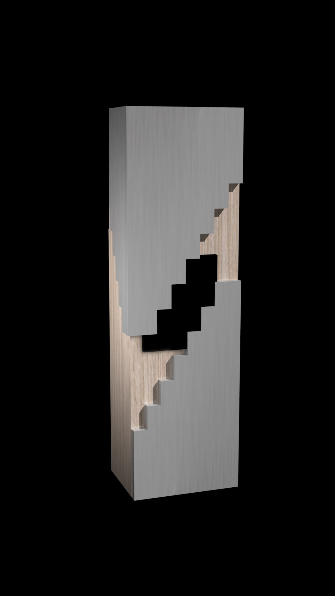
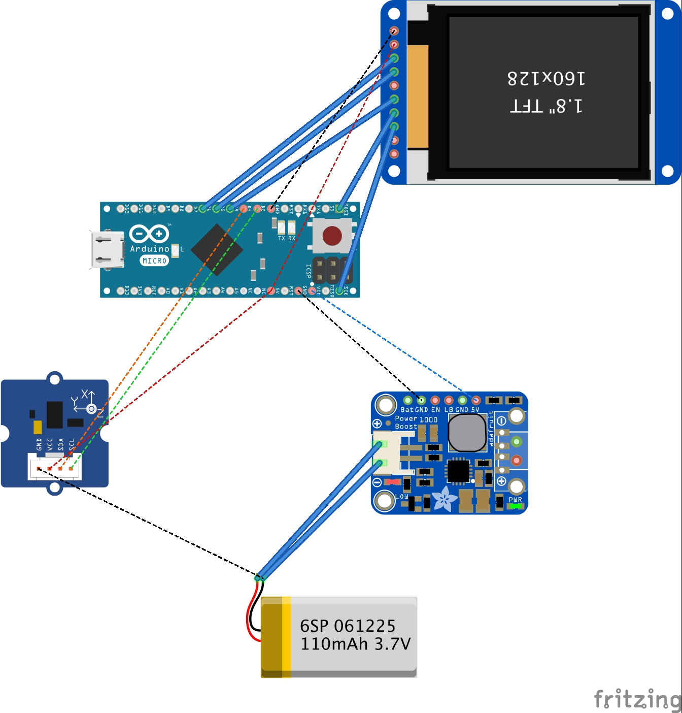

# Serious Toys
Trophy design by Carla Marceau (https://carlamarceau.fr) & Juan Gomez (https://juangomez.co)
 > Play as a way to (re)create memories of a successful and gratifying moment. Playfulness can help human memory now days give back the feeling or sensation that one has lived before.
The winners of GSGS 2018  will be awarded a trophy which they can interact daily as well as hack it from the inside to make it their own.
The trophy will take shape as a totem which users can play with and not only put as a decoration. The modularity of its pieces creates an infinite combination of shapes for creating a new object every time the winner interacts with it.

 
## Images
* [images dir](/images)

# Accelerometer

http://wiki.seeedstudio.com/Grove-3-Axis_Digital_Accelerometer-1.5g/

# Screen

https://store.arduino.cc/arduino-lcd-screen

# Arduino micro

https://store.arduino.cc/arduino-micro

# Battery

https://www.amazon.com/Dromida-3-7V-350mAh-Battery-Camera-Quadcopter/dp/B01MT3M525

# Battery booster

https://www.adafruit.com/product/2465

# Schematic

Big thanks to Gordan Savičić (https://github.com/fleshgordo) and Pierre Rossel 

